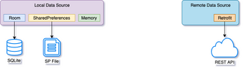
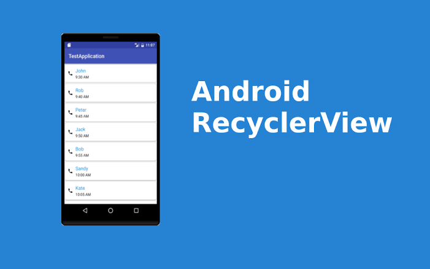

# :rocket: Android-Roadmap 

  

   
This road-map for android development that can help you to improve your skills with very recommended articles and other resources. 

**Before we start providing you with resources**..    
## :cyclone: What about android as operating system(OS): 

  

 

Android is a mobile operating system based on a modified version of the Linux kernel and other open source software.   
**Designed for:**   
  
- Smartphones & Tablets :iphone:
- Tv :tv:
- Wear OS :watch:
- Android things :crystal_ball:
---

`First of all we should learn a programming language from [java or Kotlin] and XML [for building the user interface(UI)]`

## I recommend you to start with java as a programming language.. why? :sweat_smile:

- In my opinion most of apps built with java and if you worked somewhere at a company , how do you refactor or add new features to this app that built with java!
- Most of open source was written with java.
- There are much more Java tutorials and almost every solution for Android problems on pages like Stack Overflow from the last years have been written in Java. 
- Understanding the syntax of a language is one thing, but to actually build apps you have to learn how to use the different framework and library APIs. You have to learn what classes you have to use and which methods you have to call in the different phases of your app. And for this you need practice and a lot of examples you can refer to.

**`Don't worry Java is not going to be obsolete` :muscle:**  

## Learn java: (Due to 3 or 4 weeks)

  

   

#### :clipboard: Resources: `choose only one resource (Arabic or english)`     
**Arabic**   
Abdullah Almehmadi:   
1. [Java 101](https://www.youtube.com/watch?v=3QC6Zpz3As4&list=PL28DDB2DCF87BEE43)   
2. [Java 102](https://www.youtube.com/watch?v=9w1jLen1lRU&list=PL138BE19EA2405C94)   
3. [Java 103](https://www.youtube.com/watch?v=d1b2-99QzEo&list=PLA94A6FB67AB4CD0D)   
4. [Java 104](https://www.youtube.com/watch?v=SjbXtRjavjA&list=PLqmVQqNLdVv11bup4o0bRR4zxG2Gu05gX)   

**English Crash course**    
[Check this](https://m.youtube.com/playlist?list=PLTTTcaxrixZT6v8k_QVSALXHX3KnaruuX) 
<!--
1. For Java basics syntax 
[Check this](https://youtu.be/eIrMbAQSU34)     
OR   
[Check this](https://www.youtube.com/watch?v=kJ0PKUMWnQI&fbclid=IwAR37iuJILs0vRjkyW7-ZIPz-8kd_QEcl_5QgubmCgpdCCmf4ksNXRsuufMk)     

2. Java OOP
// TODO add a good resource here.

-->
### Before moving to the next level be sure that you have a good knowledge about:   
- OOP.
- Looping (for - while - doWhile).
- Make a decision (if else - switch).
- Exception handling (try catch).
- Casting, static, final, generics.
- Using interface and abstraction and Anonynmous object.
- :point_right: **Build a simple project with java like ( Banking or Hotel or SuperMarket system)**.

`Now you are ready to start with android`

## Basic level:
Now you are ready to build user interface using xml and write some java code at android studio. 

  

   

#### :clipboard: Resources:   
**English**   
Udacity:   
1. Android Basics: User Interface ​ (due to 1 week)   
https://mena.udacity.com/course/android-basics-user-interface--ud834  

2. Android Basics: User Input ​ (due to 2 weeks)   
https://mena.udacity.com/course/android-basics-user-input--ud836  

3. Android Basics: Multiscreen Apps​ ​ (due to 1 Month)   
https://mena.udacity.com/course/android-basics-multiscreen-apps--ud839   

After you have learned to use Relative and Linear layout.. there is another amazing thing called **Constraint layout** to build a responsive layout   
[check this playlist](https://www.youtube.com/watch?v=4N4bCdyGcUc&list=PLrnPJCHvNZuA80lNWNCLICR3qYzhw3iPI)   

**`Go a head and build a project and use the tools that you learned in basic level`**

### After that you are ready to work with database and networking so..   

### Database in android:

  

   
In android world.. the database commes from different sources (Local & Remote).   

**Local:** We use shared preference and room database(based on sqllite).

**Remote:** We can use firebase or some thing called API.

**:point_right: `Don't Worry right now about that, we 'll provide you with useful resources to learn that`**

## Intermediate part 1: 
Before that you should learn an important view called recycle view.. Why?    
Most of android apps need to display a list of any type of data for users so the best way to handle that using recycler view. 

  

#### :clipboard: Resources:   
1. [check this tutorial](https://www.vogella.com/tutorials/AndroidRecyclerView/article.html)   

What is Database generally       
#### :clipboard: Resources:   
2. [simple tutorial](https://youtu.be/FR4QIeZaPeM)    

then start with learning sqllite commands before implement it with android studio:
#### :clipboard: Resources:   
3. ProgrammingKnowledge: [check this](https://www.youtube.com/playlist?list=PLS1QulWo1RIa0-Cs2Qx6GFyiIVVVS9lCS)   

`Additional but very useful:`   
*To master sqllite* check this [Sqllite fully tutorial](https://www.sqlitetutorial.net)   

 
Learn how to store data into your local database of your application by learning room database.   
#### :clipboard: Resources:
4. **TODO** Add a room db resources. 

---

## Intermediate part 2:
You should learn networking basics: (working with a remotely data)
#### :clipboard: Resources:
Android Basics: Networking ​ (due to 5 weeks)
1. [check this](https://mena.udacity.com/course/android-basics-networking--ud843)   

So now you need to learn about recycler view, fargments, notification, room database and working with some libraries and more..
#### :clipboard: Resources:
Udacity:  
2. [check this](https://mena.udacity.com/course/new-android-fundamentals--ud851)   

Then you should learn the best libarary in android development that working with APIs called (Retrofit)   
#### :clipboard: Resources:
Coding in flow.   
3. [check this](https://www.youtube.com/watch?v=4JGvDUlfk7Y&list=PLrnPJCHvNZuCbuD3xpfKzQWOj3AXybSaM)

#### Now you need to learn some thing awesome called (Material design)

  

 

Material is an adaptable system of guidelines, components, and tools that support the best practices of user interface design. Backed by open-source code, ...

Material Design for Android Developers:    
4. [check this](https://eu.udacity.com/course/material-design-for-android-developers--ud862)    

**:point_right: `Go a head and build a project and use the tools that you learned in basic level and Intermediate part 1&2`**

## Advanced part 1:
Alright, you need to add some more features for your app like playing music, integrate google maps into your app, push notification and more..   
#### :clipboard: Resources:
Advanced Android App Development.  
1. [check this](https://mena.udacity.com/course/advanced-android-app-development--ud855)

### After that I think you are ready to learn kotlin:

  

 

#### :clipboard: Resources:   
**English**   
2. [Kotlin crash course](https://www.youtube.com/playlist?list=PLsyeobzWxl7rooJFZhc3qPLwVROovGCfh)     

**After finishing this course above you should be sure that you are good at:**   
- val, var, lateinit
- inline function
- Scoped funs
- const VS val
- data class
- sealed class
- Higher order funs and lambda experssion

3. What is android jetpack?    
[check this video](https://youtu.be/LmkKFCfmnhQ)    
Get hands dirty with Android Jet-pack.

4. Learn more about Architecture pattern (MVVM, MVP, MVI).

**:point_right: `Go a head and build a project and use the tools that you learned in the previous levels`**

## Advanced part 2:
- Now, you need to know more about retrofit and it's customization.
- Learn some design patterns (Builder, singleton, factory, prototype, observer, ...).
- Reactive programming.
- Kotlin coroutines. 
- Dependency injection (DI).
- Jet-pack Compose 
- Sensors.
- Security.
- Testing.

## What after that: :thinking:   
I think you need to keep learning more and more..
